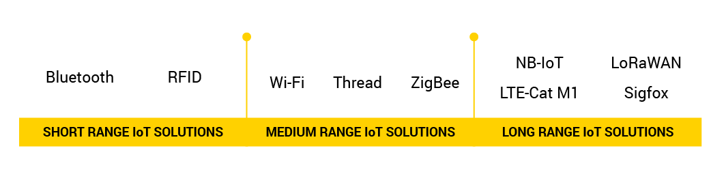

# Криптографическая защита данных в IoT системах

## Введение

[What is Internet of Things?](https://www.avsystem.com/blog/what-is-internet-of-things-explanation/)

## Основная часть

[IoT Standards and Protocols](https://www.postscapes.com/internet-of-things-protocols/)

[What technologies are used in IoT](https://www.avsystem.com/blog/iot-technology/)

[IoT Standards and protocols guide](https://www.avsystem.com/blog/iot-protocols-and-standards/)

[Comparing Wireless Protocols for IoT Devices](https://glowlabs.co/wireless-protocols/)

[ZigBee Wiki](https://zigbee.wiki/)

## Официальные источники

[ZigBee - Connectivity Standards Alliance](https://csa-iot.org/all-solutions/zigbee/)

[Z-Wave Alliance](https://z-wavealliance.org/)

## Безопасность

[Security Evaluation of the Z-Wave Wireless Protocol](https://sensepost.com/cms/resources/conferences/2013/bh_zwave/Security%20Evaluation%20of%20Z-Wave_WP.pdf)

## Атаки

[Security attacks to ZigBee technology and their practical realization](https://www.cic.ipn.mx/~pescamilla/MS/papers_2014/DurechandFranekova2014.pdf)

[Z-Shave. Exploiting Z-Wave downgrade attacks](https://www.pentestpartners.com/security-blog/z-shave-exploiting-z-wave-downgrade-attacks/)

---

by [@ivanshilyaev](https://github.com/ivanshilyaev), 2021-2022
