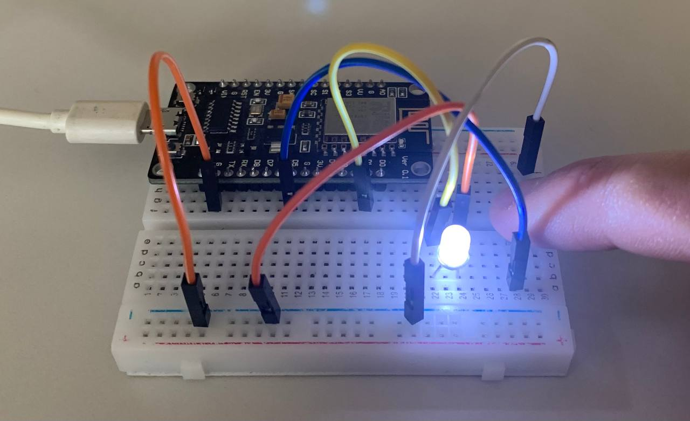
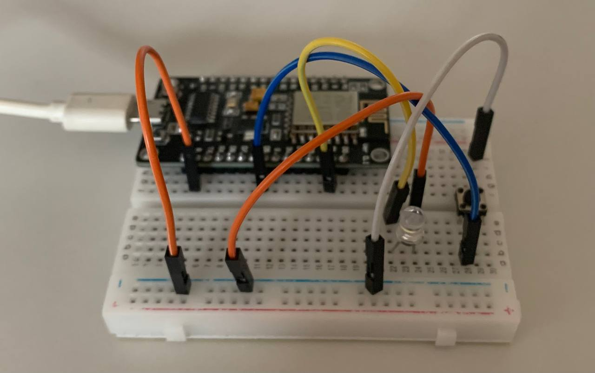

# Practice

Цель: альтернативная прошивка ZigBee (видоизменение имплементации протокола).

Нужно иметь: микроконтроллеры, которые будут работать на этой прошивке (на этапе разработки нужно иметь эмуляторы).

Задачи:

- [ ]  найти имплементацию ZigBee с возможностью модификации
- [ ]  найти устройства (контроллеры), который работают на этой имплементации
- [ ]  найти эмуляторы для контроллеров
- [ ]  начать экспериментировать с имплементацией

Криптографическая часть далее

Проблема: выбрать микроконтроллер.

### Ideas

- Просмотреть существующие имплементации на GitHub
- Отфильтровать написанные на Java/Kotlin
- Если не Java, то посмотреть на C или на Python.
- Поискать (без привязки к протоколу): тестирование алгоритма безопасности, предназначенного для умных устройств. Методы тестирования (в рамках ограниченных вычислительных ресурсов и т.д.)

### Solution

Купить плату (пр. ESP32). (в качестве управляющего устройства (хаба) будет компьютер; при большом желании и наличии времени можно будет сделать raspberry). Кабель для платы, чтобы её запрограммировать (прошивать). К плате можно подключить датчик (освещённости, увлажнения или что-то ещё; в идеале лампочку).

1. Продумать, как будет осуществляться соединения платы с управляющим устройством (компьютером, хабом и т.д.)
2. Если это bluetooth (например), то он должен работать как обычно, а внутри наша криптография (на оборачивать сам bluetooth в наши алгоритмы)
3. Идея в том, чтобы канал был “перехватываемым”, чтобы сообщения были отслеживаемы. Можно будет показать, где незашифрованные сообщения, а где начинается зашифрованный этап.

План:

1. Поднять канал, отправить с компьютера (хаба) “Hello world”. Дальше заниматься криптографией (шифрование, контроль целостности).
2. Если будем делать инкапсуляцию, то придумаем свой простой протокол из нескольких шагов.
3. В конце проверим стойкость и будем думать в сторону легковесной криптографии (пр. уменьшить длину ключа, чтобы не сильно понизить стойкость).

### ESP 32

- серия недорогих микроконтроллеров с низким энергопотреблением
- SoC (System-on-a-Chip). Интегрированные Wi-Fi и Bluetooth контроллеры
- На чём можно программировать: Arduino IDE, Espressif IoT Development Framework, PlatformIO Ecosystem & IDE

### Resources

Платформа для домашней автоматизации на Java:

[openHAB](https://www.openhab.org/)

Прошивка на плюсах, контроллеры для устройств Xiaomi:

[Hello NXP JN5169 World](https://habr.com/ru/post/547374/)

ESP32:

[Программирование устройств на основе модуля ESP32](https://habr.com/ru/company/epam_systems/blog/522730/)

Использование Java:

[Get Started - App Development on ESP32-WROVER-KIT V4.1](https://developer.microej.com/create-your-first-application/get-started-app-development-on-espressif-esp32-wroverkit-v41/)

Использование C#:

[.NET nanoFramework - Making it easy to write C# code for embedded systems.](https://www.nanoframework.net/)

### First step

```cpp
#include <Arduino.h>

void setup() {
  pinMode(LED_BUILTIN, OUTPUT);
  Serial.begin(921600);
}

void loop() {
  delay(1000);
  digitalWrite(LED_BUILTIN, HIGH);
  delay(1000);
  digitalWrite(LED_BUILTIN, LOW);
}
```

### Diode blinking

- Макетная плата (breadboard)
- Диод: длинная ножка (+, анод), короткая ножка (-, катод)
- Диод подключается через токоограничивающий резистор

Схема: D1 к аноду, G (grand) к катоду.


```cpp
#include <Arduino.h>

void setup() {
  Serial.begin(115200);
  pinMode(D1, OUTPUT);
}

void loop() {
  digitalWrite(D1, LOW);
  delay(1000);
  digitalWrite(D1, HIGH);
  delay(1000);
}
```

### Control diode with the button (turning on and off)

button — D5, diode — D1.





```cpp
#include <Arduino.h>

byte lastButtonState;
byte ledState = LOW;

unsigned long lastTimeButtonStateChanged = millis();
unsigned long debounceDuration = 50; // millis

// D1 = LED_PIN
// D5 = BUTTON_PIN

void setup() {
  pinMode(D1, OUTPUT);
  pinMode(D5, INPUT_PULLUP);
  lastButtonState = digitalRead(D5);
}

void loop() {
  if (millis() - lastTimeButtonStateChanged >= debounceDuration) {
    byte buttonState = digitalRead(D5);
    if (buttonState != lastButtonState) {
      lastTimeButtonStateChanged = millis();
      lastButtonState = buttonState;
      if (buttonState == LOW) {
        if (ledState == HIGH) {
          ledState = LOW;
        }
        else {
          ledState = HIGH;
        }
        digitalWrite(D1, ledState);
      }
    }
  }
}
```

### Connect to Wi-Fi

Control LED (switch on & off) over Wi-Fi.

Todo on this task:

- [ ]  Store wi-fi credentials in properties
- [ ]  Use WebSerial as Remote Serial Monitor (for debugging purposes)
- [ ]  Rewrite web server (maybe even on Java) to control LED

### Steps to run C code in Java

1. Create Java file with native method

```java
class LibraryNative {
    public static native void greetings();
}
```

2. Compile the file with -h option. LibraryNative.h file will be generated

```bash
javac LibraryNative.java -h .
```

3. Create file LibraryNative.c. Be careful with method signature

```c
#include <jni.h>
#include <stdio.h>
#include "LibraryNative.h"

JNIEXPORT void JNICALL Java_LibraryNative_greetings(JNIEnv *env, jclass thisClass) {
    printf("Hello Native!\n");
    return;
}
```

4. Compile C file to .dylib

```bash
gcc -I"$JAVA_HOME/include" -I"$JAVA_HOME/include/darwin" -dynamiclib -o libLibraryNative.dylib LibraryNative.c
```

5. Run the main class

```java
public class Runner {

    static {
        System.loadLibrary("LibraryNative");
    }

    public static void main(String[] args) {
        LibraryNative.greetings();
    }
}
```

[More on this here](https://www3.ntu.edu.sg/home/ehchua/programming/java/javanativeinterface.html)
